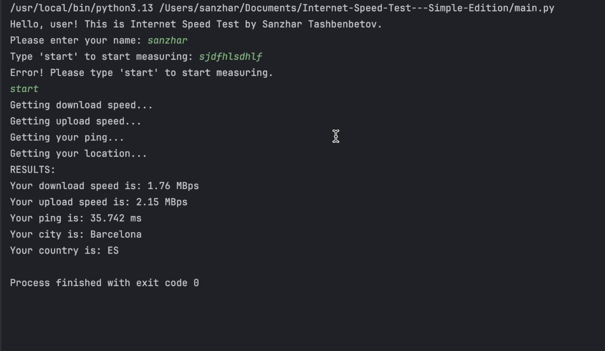

# Internet-Speed-Test---Simple-Edition

- Internet Speed Test

## Description
- I guess, the name is pretty self-explanatory, the program will measure download and upload speed, then show the data to user.
- measure download and upload speed, then show the data to user.
- for everyone

## Screenshots

## Installation

- look up requirements.txt and install all libraries from there, then press run button

## Usage

▶ [Watch demo video](assets/showcase.gif)

# Complited functionality and approximate grades from your perception
- user starts with the entering his name and then typing 'start' - otherwise the program won't run
- then program measures the speed of the internet and gets location of the user, then stores it in CSV file.
- Location data is provided by an external API (ipinfo.io). Because IP-based geolocation is not always accurate, the returned city/region may sometimes be approximate or incorrect. This does not affect program functionality.

## TODO
- Todo-list: 
- use Speedtest Client library for, well, measure download and upload speed 
- also create a CSV file storing the data of each user who ran this program.

### Incomplete Planned Features
- 

## Project Structure

- my_project/
- ├── .git/                 # Git repository (created automatically)
- ├── .gitignore            # Files to ignore in Git
- ├── README.md             # Project description
- ├── requirements.txt      # Python dependencies
- ├── main.py               # Main entry point
- ├── data_utils.py
- ├── location_utils.py
- └── assets              # Data files
    └── showcase.mp4
    └── data.csv
    └── screen.png

## Acknowledgments

- sppedtest.org for inspiration

## Team Members
- GitHub: [@sanzhar-learning](https://github.com/sanzhar-learning)
- Email: sanzhar.learn@gmail.com

## Support

- you can support me with the good grade for this project :0